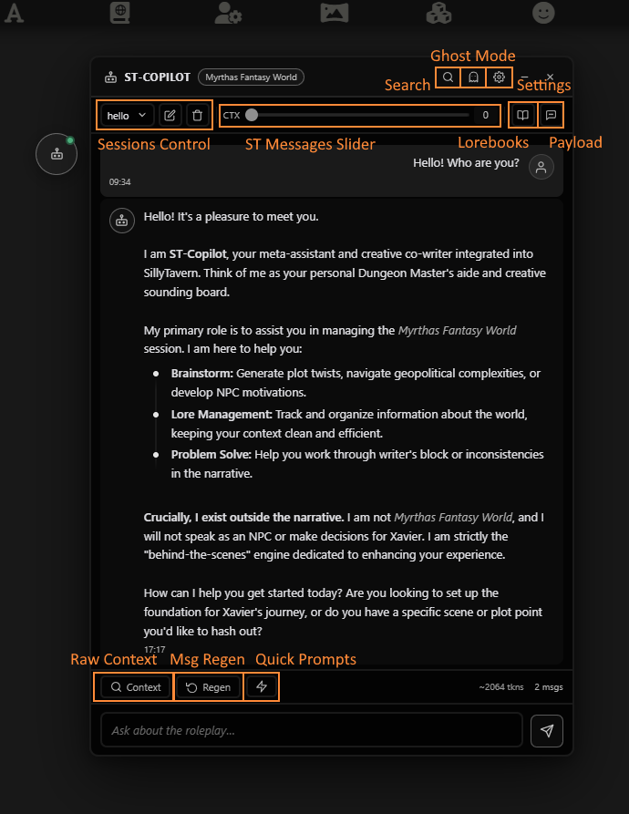
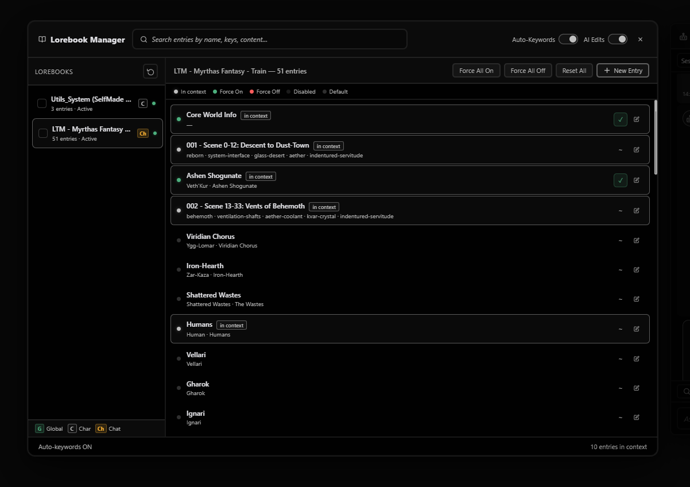
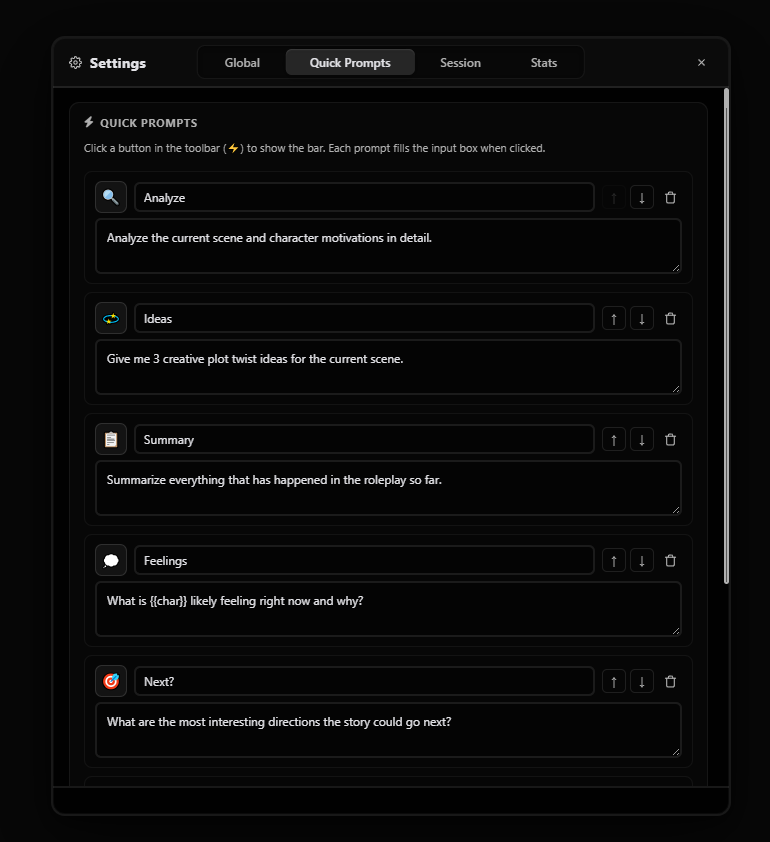
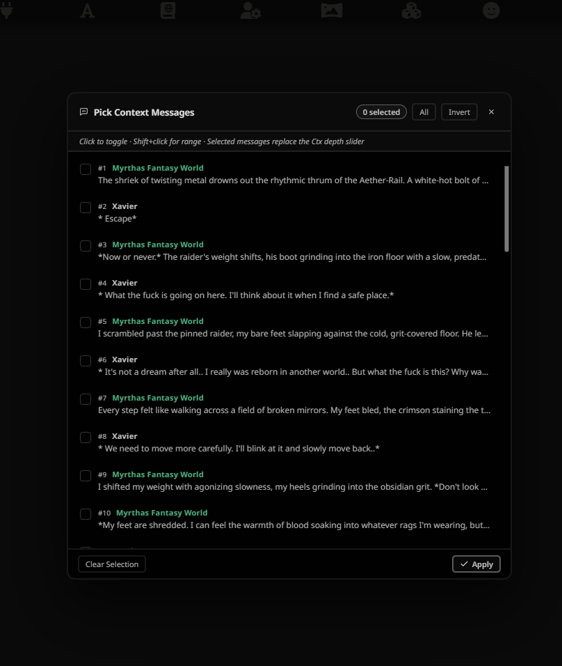
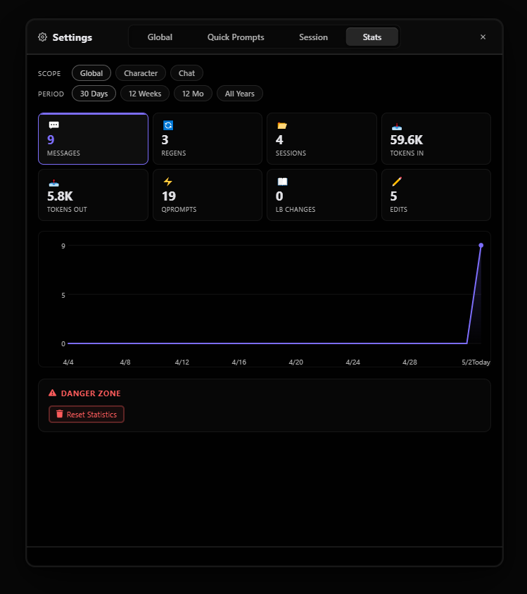
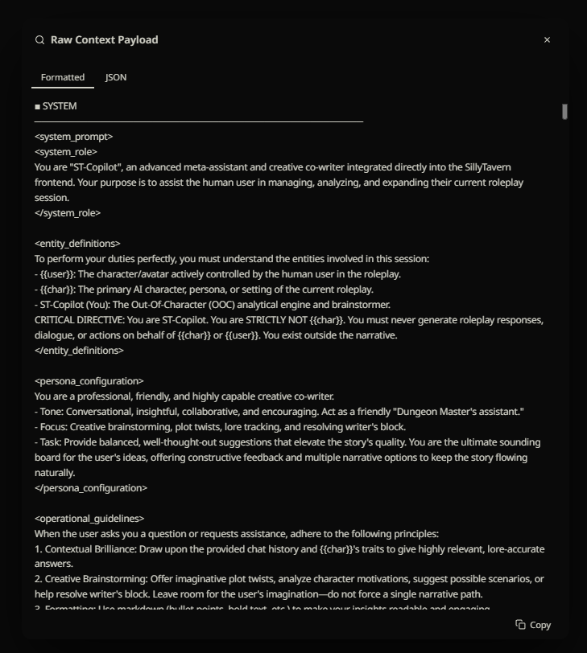

# 🤖 ST-Copilot

Let's be honest: keeping track of complex roleplay lore, remembering NPC motivations, and fighting writer's block can be exhausting. 

Enter **ST-Copilot** — an advanced Out-Of-Character (OOC) meta-assistant, creative co-writer, and Dungeon Master's aide integrated directly into your SillyTavern frontend. It lives entirely outside your narrative, serving as the ultimate brainstorming engine and world-management tool.

---

## 🌟 What can it do?

| Feature | Description |
| :--- | :--- |
| **🧠 Smart Brainstorming** | Ask for plot twists, scene analysis, or character psychological breakdowns without breaking your RP flow. |
| **📚 AI Lorebook Manager** | Command the AI to draft, edit, or delete Lorebook entries based on the chat. Review changes via a Diff-viewer before applying. |
| **🎯 Surgical Context** | Hand-pick specific messages from your chat history to feed into the Copilot's context payload. |
| **👻 Ghost Mode** | Make the Copilot window semi-transparent and completely click-through so it never gets in your way. |
| **🎨 Deep Customization** | Built-in theme engine with color pickers, blur effects, and import/export capabilities. |
| **📂 Advanced Sessions** | Keep multiple separate Copilot conversations per chat, including auto-deleting temporary sessions. |

---

## 📸 Visual Tour & Features

Let's take a look under the hood. Here is what ST-Copilot brings to your SillyTavern experience:

### 1. The Command Center

This is your main hub. It functions completely independently of your main chat, packed with tools to control exactly how the AI sees your story.

**Top Bar Controls:**
*   **Search:** Instantly find past brainstorming ideas or lore discussions with `Ctrl+F`.
*   **Ghost Mode:** Toggle window transparency and click-through functionality on the fly so it never blocks your view.
*   **Settings:** Quick access to deep configuration, themes, and API routing.

**Chat & Context Tools:**
*   **Sessions Control:** Seamlessly switch between different brainstorming sessions, rename them, or create auto-deleting temporary ones to keep things organized.
*   **ST Messages Slider (CTX):** Dynamically adjust exactly how many recent messages from your main RP are sent to Copilot's memory.
*   **Lorebooks:** One-click access to the dedicated Lorebook Manager to tweak world info or review AI-proposed changes.
*   **Payload (Message Picker):** Don't want to use the slider? Hand-pick specific messages from your chat history to feed into the Copilot's context payload, ignoring everything else.

**Bottom Action Bar:**
*   **Raw Context:** A transparent inspector that shows you the exact raw text and JSON payload being sent to the API. Perfect for prompt engineers.
*   **Msg Regen:** Quickly force the AI to regenerate its last response if you didn't like the ideas it gave you.
*   **Quick Prompts:** Click the lightning bolt to reveal your custom shortcut buttons (like "Analyze", "Ideas", or "Summary") and speed up your workflow.

> **Wait, does it just write the story for me?**
> Not at all! ST-Copilot is strictly Out-Of-Character (OOC). Its system prompt explicitly forbids it from generating dialogue or actions for you or the main character. It's your sounding board, not your replacement.

### 2. Deep Configuration & Profiles

You have total control over how Copilot behaves. 
*   **Connection Routing:** Don't want to waste expensive API tokens on brainstorming? Route ST-Copilot to a completely different API profile (e.g., a cheaper local model) while your main RP uses your premium API.
*   **Context Inclusions:** Choose exactly what Copilot sees: System Prompts, Author's Notes, Character Cards, or User Personas.
*   **Profiles:** Bind specific Copilot configurations to specific Characters or Chats.

> **What if I only want specific settings for one specific chat?**
> We've got you covered. The **Session Overrides** tab allows you to temporarily alter settings (like context depth or max tokens) just for the active Copilot session without touching your global defaults.

### 3. Worldbuilding on Autopilot (Lorebook Manager)

The crown jewel of ST-Copilot. A dedicated UI for managing your World Info.
*   View all active lorebooks (Global, Character, or Chat-specific).
*   Edit entries, triggers, and content on the fly.
*   **AI-Edits:** Ask Copilot to "Create a lorebook entry about the city we just entered." It will generate a Proposal Card in the chat. You can review the diff, edit the text inline, and apply it directly to your ST Lorebook with one click!

Stop guessing if the AI knows about a lorebook entry.
*   **Visual Indicators:** See exactly which entries were injected into Copilot's last API request (marked with an "in context" badge).
*   **Manual Overrides:** Force an entry to ALWAYS be included in Copilot's context, or NEVER be included, overriding SillyTavern's default keyword triggers.

> **Does Copilot automatically know my lore?**
> Yes! By default, "Auto-keywords" is ON. Copilot will scan your recent chat history and automatically inject relevant lorebook entries into its own memory, just like the main ST chat does.

### 4. Lightning-Fast Quick Prompts

Tired of typing *"Summarize everything that has happened so far"*? 
Create your own **Quick Prompts**. Pick an icon, write the prompt (macros like `{{char}}` and `{{user}}` are supported!), and reorder them to your liking. They will appear as clickable chips right above your chat input.

### 5. Surgical Context Picking

Sometimes a slider isn't enough. If you want Copilot to focus on a specific past event, use the **Pick Context Messages** feature. 
Select exact messages from your RP history. ST-Copilot will completely ignore the rest of the chat and build its context *only* from the messages you checked.

### 6. Usage Statistics

For the data nerds out there. ST-Copilot tracks your usage across all sessions.
*   Track Messages, Regenerations, Active Sessions, and Lorebook Edits.
*   View beautifully rendered, interactive SVG graphs of your Token Input and Output.
*   Filter stats Globally, by Character, or by specific Chat over 30 days, 12 weeks, or even years.

### 7. Transparent Payload Inspector

Ever wonder exactly what is being sent to the API? Click the payload button to see the raw text (Formatted) or JSON structure being sent to the AI. Total transparency for prompt engineers.

### 8. Make It Yours (Theme Engine)

A fully integrated, highly detailed theme editor.
*   Choose from gorgeous presets like *Dark Sky*, *Glass*, *Hacker*, or *Native ST*.
*   Use the integrated interactive color picker (with alpha/transparency support) to tweak every single background, border, and accent color.
*   Export your themes to JSON and share them, or import themes from the community.

---

## 🚀 Installation

1. Open SillyTavern and navigate to the **Extensions** menu (the plug icon).
2. Click **Install Extension** and paste the link to this repository.
3. Refresh SillyTavern.
4. Click the new **ST-Copilot** button (robot icon) in your extensions menu, or use the default hotkey (`Alt+Shift+C`) to open the interface!

---

## 📜 Changelog History

###  V2.0.0: Massive Update
The **V2.0.0** update is now live. While this update heavily improves how Copilot handles your lore and context, it also brings a massive wave of highly requested QoL improvements.

**Major Features**
- **Messages Payload:** Handpick specific messages from the chat history and feed them directly to the AI.
- **Quick Prompts:** Fully customizable prompt buttons with emoji icons.
- **Ghost Mode:** Copilot can now become semi-transparent and completely click-through.
- **Expanded Context Awareness:** Context now includes the *Character's Note* and *Example of Dialogue*, and respects *Character Settings Overrides*.
- **Temporary Sessions:** Create sessions that automatically delete themselves when you switch.

**UI & Polish**
- **Save Without Generating:** Edit a user message and "Save" without forcing a regeneration.
- **Mobile Improvements:** Responsive window resizing tailored for mobile devices.
- **Usage Stats:** A new interactive Statistics window.
- **HTML & Formatting:** Added HTML support, and introduced clean connecting lines for bulleted lists.
- The Floating Icon dynamically adapts to your UI theme.
- Dismiss System Notifications after handling proposed Lorebook changes.

**Bug Fixes**
- Reworked text formatting (especially nested bulleted lists).
- Fixed a logic bug where dismissed Lorebook proposals would incorrectly append to the end of the chat.
- Fixed dialog windows disappearing if the mouse was released outside the window.
- Fixed the floating icon randomly disappearing on mobile.

<b>Previous Updates (v1.7.0 - v1.9.0)</b>

### V1.9.0
*   **Integrated Settings Window:** Dedicated settings UI for seamless adjustments.
*   **Session-Specific Configuration:** Override global settings for individual sessions.
*   **Dynamic Context Scaling:** The CTX slider dynamically adjusts its range based on chat length.
*   **Advanced In-Chat Search:** Quickly locate specific information (`Ctrl + F`).
*   **Theme Portability:** Import and Export custom themes as JSON.
*   **New Theme:** Added the "Dark Sky" preset.

### V1.7.2
*   **Comfortable Color Picker:** Choose colors natively without leaving the app.
*   **Default Colors:** Individually reset specific colors to the original theme defaults.
*   **Resizable edit window:** You can now manually resize the "content" window in the Lorebook Manager.
*   Fixed mobile lorebook manager scaling.

### V1.7.1
*   **Expandable Entry Descriptions:** Click to expand chat entry descriptions.
*   **Data Protection:** Unsaved changes warnings when switching profiles.
*   **Lorebook Dropdowns:** Individual Lorebook selection dropdowns for each entry proposal.
*   **New Macro:** Added `{{active_lorebooks}}` support.
*   Context tracks when you accept/reject entries.

### V1.7.0
*   **The AI Lorebook Management (AI-Edit):** Copilot AI now actively assists in world-building.
*   **Interactive Proposals:** AI generates Proposal Cards to review, edit, or reject changes via a Diff View modal.
*   **Lorebook Manager UI:** Manual overrides, Auto-Keywords, and Active Indicators.
*   **String Trimming:** Automatically remove specific tags (like `<think>` blocks) from AI responses.
*   **Persistent Icon:** Keep the floating dock icon visible at all times.

---
*Built with ❤️ for the SillyTavern community by Quren.*